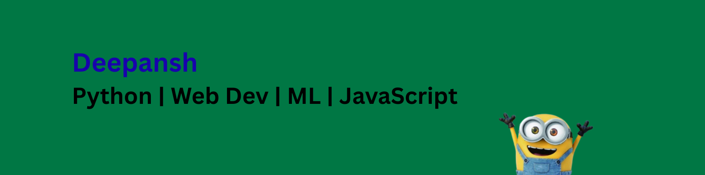

  

### 👋 What I'm up to

- 🔭 Digging deeper into core **ML concepts** — from algorithms to model tuning
- 📊 Hands-on with libraries like **Scikit-learn, Pandas, Seaborn**, and tools like **Colab** and **Jupyter**
- 🧰 Building projects & joining **hackathons / open-source**
- 💌 Contact me: **umardeepansh@gmail.com**

---

### 🔗 Connect with Me

  

---

### 💻 Coding Profiles

  
  

---

### 🛠️ Languages and Tools

  

  <!-- CSS3 -->
  

  <!-- Flask -->
  

  <!-- Google Cloud Platform (GCP) -->
  

  <!-- HTML5 -->
  

  <!-- Java -->
  

  <!-- JavaScript -->
  

  <!-- Pandas -->
  

  <!-- PostgreSQL -->
  

  <!-- Python -->
  

  <!-- scikit-learn -->
  

  <!-- Seaborn -->
  

  <!-- SQLite -->
  

  <!-- Vue.js -->
  

---

### 🚀 Projects & Interests

- 🧠 Currently diving into **Machine Learning**, working on hands-on projects to deepen my understanding
- 🌐 Building **Web Development** projects to refine my full-stack skills
- 🤝 Always open to contributing to **open-source** and collaborating with the developer community
- 🎧 Enjoys peaceful music like **Lo-fi**, while working or relaxing
- 🌱 Continuously learning and experimenting — focused on **growing as a developer and problem solver**

---

### 📈 GitHub Stats

  

  

---

### 📊 GitHub Contribution Graph

  

---

### 🟩 Contribution Calendar

